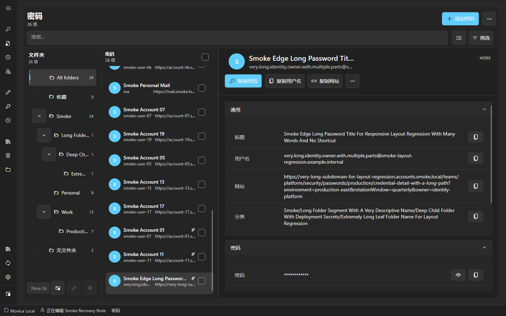
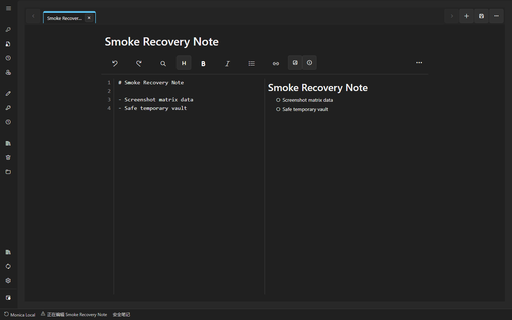
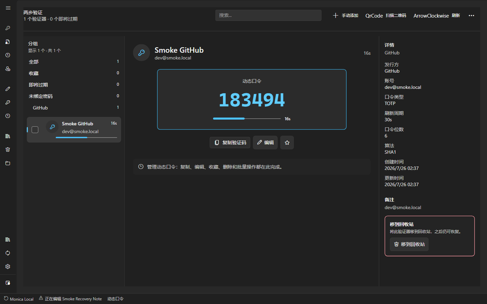
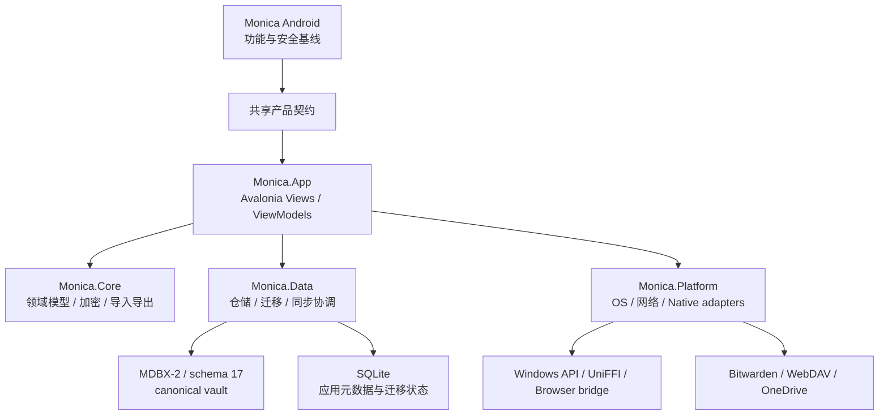

# Monica by Avalonia

<p align="center">
  
</p>

<p align="center">
  <strong>Monica 的本地优先桌面密码库：以 Android 主应用为功能与安全基准，
  以 Avalonia 提供跨平台桌面体验。</strong>
</p>

<p align="center">
  <a href="https://github.com/Monica-Pass/Monica-by-Avalonia/actions/workflows/check.yml">
    
  </a>
  
  
  
</p>

## 产品定位

Monica by Avalonia 是 Monica 的桌面端实现，主要面向 Windows，同时保留
macOS 与 Linux 的跨平台构建目标。它不是把 Android 界面直接搬到桌面：

- **产品与安全基线来自 Monica Android。** 数据格式、核心能力、安全边界和兼容路线
  以主应用为准。
- **桌面交互遵循 Avalonia 与平台习惯。** 导航、命令栏、主从布局、键盘操作、窗口生命周期和
  平台集成按桌面使用习惯设计，并保持跨平台行为一致。
- **Vault 业务数据以 canonical MDBX 为准。** SQLite 保留应用元数据、迁移状态和集成
  记账，不再作为解锁后 vault 业务数据的双重真源。

当前通用功能范围、剩余差距与平台取舍见[Android 与桌面功能对齐](docs/android-desktop-parity.md)。
Wi-Fi 条目支持网络名称、加密类型、隐藏网络、连接二维码文本/图片导入及按需显示与安全复制；
Android 企业认证、代理和静态 IP 等扩展设置在编辑常用字段时保留。

本仓库不会生成 Android 或 iOS 包。Monica Android 仍由
[Monica 主仓库](https://github.com/Monica-Pass/Monica)独立维护和发布。

## 主要能力

| 工作区 | 已实现能力 |
| --- | --- |
| 密码库 | 密码、用户名、网址、自定义字段、附件、收藏、归档、回收站、批量操作和可嵌套分类目录 |
| API Key | 与 Android 兼容的 API 密钥条目、加密密钥、提供方网址和可选请求地址；不参与自动填充 |
| 动态口令 | TOTP/HOTP、二维码导入与扫描、搜索、收藏、编辑和安全复制 |
| 安全笔记 | 多标签编辑、Markdown 预览、图片附件、嵌套目录和草稿恢复 |
| 钱包 | 银行卡、身份资料、证件、登录条码、账单地址及其他 Android 对应类型 |
| 安全分析 | 弱密码、重复密码、泄露检查入口和按风险优先级组织的处理流程 |
| 导入导出 | Monica JSON、CSV、Bitwarden JSON、KeePass KDBX、Aegis 等迁移路径 |
| 同步与备份 | Bitwarden 在线账户同步、WebDAV 备份恢复、OneDrive MDBX 传输和冲突保护 |
| 桌面集成 | Windows 托盘、全局快速搜索、可选截图保护、文件选择器和安全剪贴板 |
| 浏览器配对 | Chrome/Edge Manifest V3 扩展、仅回环地址的会话令牌桥接和当前站点凭据查询 |
| MDBX 工具 | Vault 创建、检查、快照、历史、冲突、恢复和数据库管理工作台 |

MDBX 健康页提供默认保险库的[未知类型与高版本条目只读查看](docs/mdbx-readonly-inspector.md)：
列表只读取摘要，查看正文时走原生授权与大小限制，字段默认隐藏。当前版本无法完整承载这些
对象时，会拒绝生成 Monica JSON 备份或清空全部数据。

Bitwarden 在线同步包括账户认证、支持的双因素挑战、待上传变更、远端下载与合并、
嵌套文件夹元数据和冲突备份。协议兼容与安全限制记录在
[Bitwarden 在线同步边界](docs/bitwarden-online-sync-boundary.md)。

## 界面一览

以下截图由真实 Monica AppHost 使用临时 canonical MDBX vault 自动生成，不包含个人数据。

### 密码库与嵌套目录



### 安全笔记



### 动态口令



## 架构与维护边界



| 项目 | 职责 |
| --- | --- |
| `src/Monica.App` | Avalonia 窗口、按功能拆分的 Views/ViewModels、对话框与桌面服务编排 |
| `src/Monica.Core` | 不依赖 UI 和存储实现的领域模型、密码学策略、TOTP、导入导出与同步契约 |
| `src/Monica.Data` | canonical MDBX 仓储、SQLite 元数据、迁移、Bitwarden 队列与冲突处理 |
| `src/Monica.Platform` | Windows 能力、HTTP 传输、WebDAV/OneDrive、KeePass 与 MDBX UniFFI |
| `tests/Monica.Tests` | 核心、数据、平台、安全和真实子进程集成测试 |
| `tests/Monica.UiTests` | Avalonia Headless 交互、性能、内存、键盘和页面组成测试 |

生成器的选项、历史、生成与复制命令由独立 `GeneratorWorkspaceViewModel` 持有；主窗口
只接入导航、语言、布局、锁定/后台清理及“保存为登录项”命令。其他工作区仍需渐进拆分。
商业质量门保留重点功能文件 300 行限制，但拆分 partial 文件不等于隔离职责；还需用
会话竞态、数据往返与工作区独立实例测试约束边界。业务规则继续留在 Core/Data/Platform。

当前 Windows 原生引擎创建的 vault 为 **MDBX-2 / schema 17**。可读格式来自运行时
manifest，是否可写还取决于文件实际声明、schema 和 critical extensions；不支持的
文件会拒绝打开，可读但不可写的文件进入只读保护。不要把“可读”当作“可以保存”。

仅修改备注等字段，且各自定义字段的 `title/value/is_protected/sort_order` 均显式存在、
值和数组顺序不变时，会保留整个原始 `custom_fields` 数组，包括未知元数据。编辑、删除或重排自定义字段仍没有稳定 ID 可用于安全匹配；本次
不宣称这些操作能无损保留子项的未知元数据。

## 安全模型

- 主密码只在需要的生命周期内参与密钥派生；解锁会话结束时释放 MDBX handle，并清理
  可清理的凭据指纹和短期密钥材料。
- 锁定、最小化后台释放和退出流程会移除敏感视觉树、详情缓存、预热编辑器和临时秘密。
- 安全剪贴板只清理由 Monica 写入且仍由 Monica 拥有的内容，避免覆盖用户后来复制的文本。
- 浏览器桥接仅监听 IPv4 loopback，使用每次解锁生成的 256 位随机令牌；锁定、禁用、
  改端口、退出或重启都会撤销令牌。
- Bitwarden endpoint、KDF 参数、CipherString 长度和认证类型均受显式策略限制；账户秘密、
  待同步载荷、错误和冲突备份使用 Monica vault AEAD envelope 持久化。
- Windows 截图保护是用户可配置开关，不会强制阻止截图。
- Windows WebAuthn 只做客户端 API 可用性探测。Monica 当前不是系统 Credential Provider，
  因而不会把桌面 passkey 状态误报为 Android Credential Provider 等价能力。

详细边界：

- [发布就绪与证据矩阵](docs/release-readiness.md)
- [浏览器桥接协议](docs/browser-bridge-protocol.md)
- [Bitwarden 在线同步边界](docs/bitwarden-online-sync-boundary.md)
- [原生 Passkey 平台边界](docs/native-passkey-boundary.md)
- [原生核边界与热路径实测](docs/native-hot-path-boundary.md)

## 构建与运行

### 环境要求

- .NET SDK 10.0 或更高版本
- 受验证的运行环境为 Windows x64；macOS/Linux 目前仅保留构建目标，见下方支持矩阵
- PowerShell 7，用于统一验证与发布脚本
- 运行产物发布脚本、重建 `monica-crypto` 或开发 MDBX CLI 回退时需要 Rust toolchain

### 还原与构建

从仓库根目录执行：

```powershell
cd ".\monica by avalonia"
dotnet restore Monica.slnx
dotnet build Monica.slnx --configuration Release
```

### 运行桌面应用

```powershell
dotnet run --project "src\Monica.App\Monica.App.csproj"
```

## 测试与质量门

核心与集成测试使用普通 `dotnet test`。日常本地跑功能通道，它不含任何墙钟预算，
机器繁忙也不会假失败：

```powershell
dotnet test "tests\Monica.Tests\Monica.Tests.csproj" --configuration Release --filter "Category!=perf-budget"
```

核心 `perf-budget` 计时预算（2026-09-28 基线为 11 项）需要独占 CPU，因此统一脚本会在其余测试之前单独顺序跑
它们；本地直接 `dotnet test`（不带 filter）时这些预算会和功能测试争抢核心，
在满载机器上会假失败。

完整验证必须使用统一脚本。它会执行仓库卫生检查、重点文件体积限制、格式验证、
NuGet 直接与传递依赖漏洞审计、Release 零警告构建、核心测试、冷启动预算和其余
Avalonia Headless UI 套件，全程不会打开可见应用窗口。

```powershell
.\eng\ci\verify-commercial-release.ps1 -Configuration Release
```

2026-09-28 的修改前基线在 `ade0e18` 上通过核心功能 1,166 项、核心性能 11 项、
UI 功能 266 项、UI 性能 17 项，Release 构建 `0 warning / 0 error`。2026-09-29
本轮改进后的结果与限制记录在[发布就绪矩阵](docs/release-readiness.md)。历史快照
不替代本轮验证，也不替代目标系统上的安装、辅助技术和真实硬件性能验收。

Headless UI 使用 xUnit v3 的进程内 runner，不能照搬核心套件的 `dotnet test` 命令：

```powershell
dotnet build "tests/Monica.UiTests/Monica.UiTests.csproj" -c Release
dotnet "tests/Monica.UiTests/bin/Release/net10.0/Monica.UiTests.dll" -filter "/[Category!=perf-budget]"
```

## 发布与分发边界

- Release 工作流默认生成 **JIT** 包；NativeAOT 仍是实验选项，不作为默认商业构建。
- 工作流为多个 RID 保留构建任务，但当前只有 Windows x64 配齐所需原生引擎。
- Build 的打包与上传必须满足 runtime smoke 的 **outcome 为 success**；AOT 的
  `continue-on-error` 只保留实验信号，不会放行未验证产物。发布脚本也显式检查 publish 退出码。
- Release 路径通过相应质量门后只会创建 **GitHub Draft Release**；本轮未触发远端工作流或发布。
- 每个草稿 Release 包含 `SHA256SUMS`，并由 GitHub build provenance attestation
  关联到当前工作流运行。
- 当前仓库没有 Windows 原生代码签名证书，也没有 macOS Developer ID 签名与公证凭据。
  在这些信任链完成并实测前，不应把草稿产物宣传为正式公开安装包。
- GitHub 分支保护、漏洞警报、秘密扫描、推送保护和组织级 Action allow-list 属于远端
  管理员设置，不会由仓库文件静默开启。

本地 JIT 预览包示例：

```powershell
dotnet publish "src\Monica.App\Monica.App.csproj" `
  --configuration Release `
  --runtime win-x64 `
  --self-contained true `
  /p:PublishAot=false
```

项目声明的运行时目标包括 `win-x64`、`osx-x64`、`osx-arm64`、
`linux-x64` 和 `linux-arm64`。声明目标不等于每个平台已经完成签名、商店认证或
人工验收，具体状态以[发布就绪矩阵](docs/release-readiness.md)为准。

### 平台支持现状（2026-09-29）

| 目标 | 当前边界 |
| --- | --- |
| Windows x64 JIT | 默认验证目标，仓库含 `mdbx_ffi.dll` 与 `monica_crypto.dll`；签名和正式分发另行验收 |
| Linux x64、macOS x64/arm64 | CI 构建目标，不是可交付的 vault 客户端；缺对应 MDBX 与加密原生库，必须补齐并通过产物门 |
| Linux arm64 | 仅声明 RID，未纳入当前 Build 矩阵，原生库与运行验收均待完成 |
| NativeAOT | 实验性，不替代 JIT；失败的冒烟不能作为发布证据 |

## MDBX 开发

应用优先使用 native UniFFI bridge。开发环境需要显式测试 CLI 回退时，可设置：

```powershell
$env:MONICA_MDBX_WORKSPACE = "D:\github\monicapass\Mdbx"
$env:MONICA_MDBX_CLI = "D:\github\monicapass\Mdbx\target\debug\mdbx.exe"
```

MDBX 客户端必须通过 storage/repository API 或明确的 FFI facade 维护 commit、
object version、tombstone、snapshot、conflict 和 device head 等元数据。不要把
MDBX 当作普通 SQLite 表直接改写。

更多规范：

- [MDBX 仓库](https://github.com/Monica-Pass/Mdbx)
- [MDBX 客户端接入指南](https://github.com/Monica-Pass/Mdbx/blob/master/CLIENT_INTEGRATION_GUIDE.zh-CN.md)
- [MDBX 规范索引](https://github.com/Monica-Pass/Mdbx/blob/master/docs/README.zh-CN.md)

## 浏览器扩展

`browser-extension/` 包含用于本地开发和配对验证的 Chrome/Edge Manifest V3
扩展。它目前通过开发者模式加载，不代表已经在浏览器商店签名发布。安装、令牌生命周期
和限制见[浏览器扩展说明](browser-extension/README.md)。

## 项目关系

- [Monica](https://github.com/Monica-Pass/Monica)：Android 主应用、产品与安全基线。
- [MDBX](https://github.com/Monica-Pass/Mdbx)：Monica 的本地优先 vault 格式与长期兼容路线。
- Monica by Avalonia：遵循桌面平台逻辑的 Windows/macOS/Linux 实现。

## 致谢

本项目使用或参考 Avalonia、FluentAvalonia、Bitwarden、KeePass、QRCoder、ZXing、
Otp.NET、Bouncy Castle、Dapper 和 Microsoft Graph 等开源生态。具体许可与声明见
[THIRD-PARTY-NOTICES.md](THIRD-PARTY-NOTICES.md)。

## 许可证

本项目基于 [GNU General Public License v3.0](LICENSE) 开源发布。
