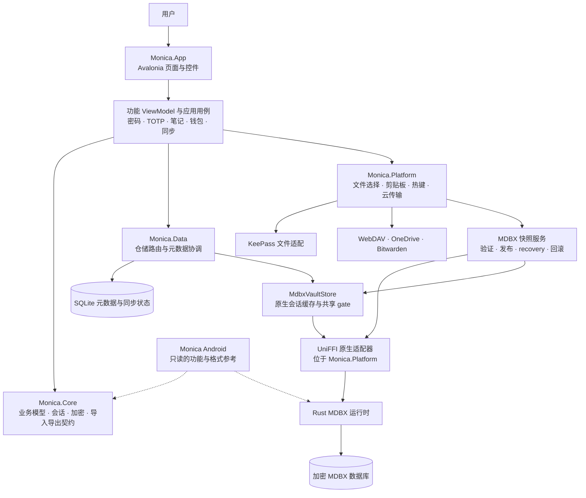

# Monica Avalonia 架构

桌面界面由 Avalonia 与 FluentAvalonia 构成。当前 `src` 项目的源码与项目引用没有
WinUI、Windows App SDK 或 `Microsoft.UI` 依赖。Windows 剪贴板、热键等系统能力
仍由 Platform 适配器实现；它们不需要 WinUI 控件或窗口运行时。

下图展示运行时协作关系；虚线表示 Android 是只读的功能与数据契约参考。

项目依赖为 App → Core / Data / Platform，Platform → Core / Data，Data → Core。
Data 定义原生桥接接口，Platform 实现它们；App 的依赖注入容器装配实际服务。
`IMdbxVaultStore` 与文件替换协调器指向同一个 `MdbxVaultStore` 实例，保证业务
读写与快照恢复使用同一把 gate。上传提交也经过该 gate，但不改变恢复代次。

桌面业务编辑器只写确切支持的原生类型和载荷版本。其他对象通过只读检查器保留，
整库快照直接复制原生数据库，不经业务模型重建。解锁、后台任务和敏感缓存随会话
取消；默认库恢复成功后完整清理旧工作区并重新加载。

Android 对齐按可验证的功能逐项推进。当前整库云快照已接入；Android `.sync`
增量段与外部 blob 协议、本地快照导出/恢复界面仍待实现。相关的数据边界与验证
结果见 [MDBX 一致性文件快照](mdbx-portable-snapshots.md)。
